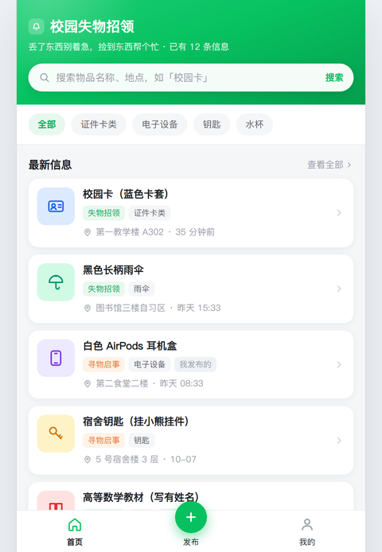
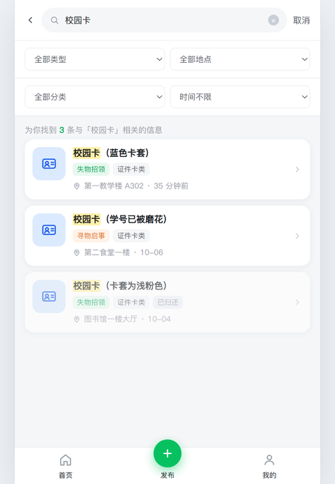
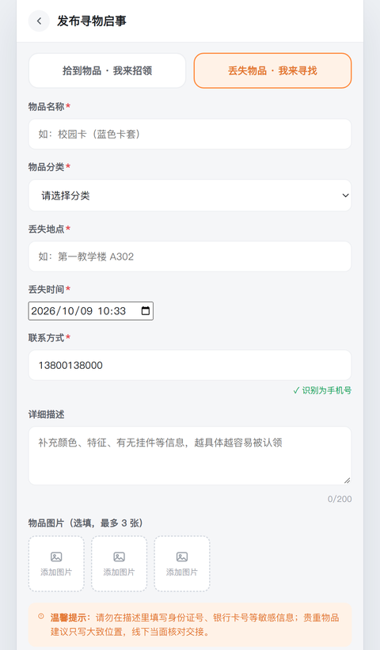
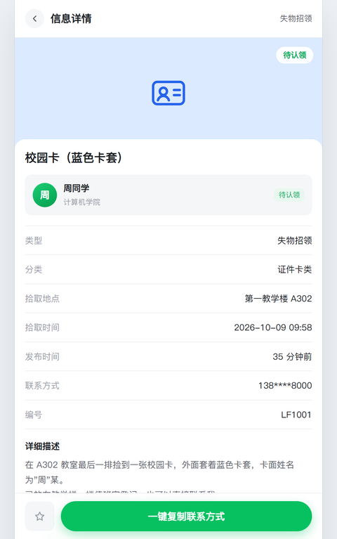
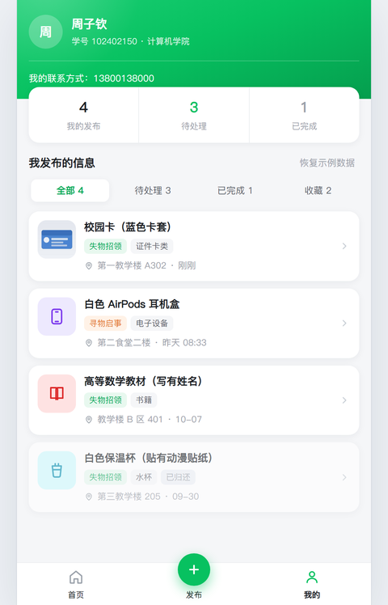
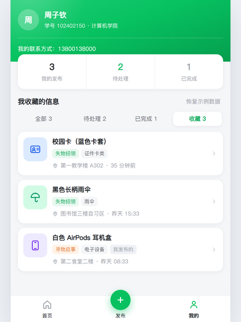

# 校园失物招领（Web 版）

> 福州大学 · 2026-01 软件工程与软件工程实践 · **第二次结对作业**
> 结对成员：102402150 周子钦、102402148 周凯
> 基于第一次结对作业（Figma 原型）实现，7 个页面一套逻辑跑通。

校园里丢东西几乎每天都在发生。同学们习惯在班级群、宿舍群里喊一声，但**信息分散、容易被刷走、没法检索**，捡到的人和在找的人常常碰不上。

这个小站把散落的寻物启事和失物招领集中到一处，做到四件事：

1. **发布**——招领和寻物分成两页，各自填各自的字段，不容易填错；
2. **查找**——关键词搜索 + 类型/分类/地点/时间四重筛选；
3. **联系**——详情页一键复制联系方式；
4. **收尾**——物品归还或找到后标记状态，自动从首页隐藏，减少无效询问。

---

## 一、快速开始

**不需要安装任何东西，不需要 Node，不需要本地服务器。**

1. 在仓库页面点 **Code → Download ZIP** 解压（或者 `git clone` 本仓库）到本地任意目录；
2. 双击解压出来的 **`index.html`**（请用 **Google Chrome** 打开，与作业要求一致）；
3. 浏览器地址栏会出现 `...#/home`，页面直接可用。

> 仓库根目录**就是**要运行的项目根目录 —— `index.html`、`css/`、`js/` 都在这层，不用再往里找。

> 为什么要用 Chrome：本项目的布局用了 flex / CSS 变量 / `position:fixed` 等标准特性，
> Chrome 下与我们的测试结果完全一致；其他浏览器理论上也能跑，但我们只在 Chrome 上验证过。

> 如果双击后页面是空白的：确认 `css/`、`js/` 两个文件夹和 `index.html` 在同一层目录，
> 且没有被解压工具打散。项目**没有任何外部依赖**，也不联网。

想在手机上试：把文件夹放到手机能访问的静态服务器上，或者用 Chrome 的开发者工具
（F12 → 左上角手机图标）切到 375×812 的移动视图，效果与原型一致。

---

## 二、界面预览

点开就能用的六个主要界面（图是 2 倍图缩到 480px）：

| 首页 | 搜索（命中关键词会高亮） |
| :---: | :---: |
|  |  |
| **发布页 · 寻物**（联系方式已预填、边打边提示识别结果） | **信息详情页**（联系方式打码 + 一键复制） |
|  |  |
| **我的发布**（分段含「收藏 N」；第一条卡片用上了缩略图） | **收藏列表**（自己收藏的和别人的混在一起排） |
|  |  |

> 说明：示例数据本身不带图片，所以直接双击打开看到的卡片仍是分类图标；
> 上面「我的发布」那张图里的缩略图，是**演示时真的发布了一条带图片的信息**之后的效果。

---

## 三、目录结构

```
102402150-102402148/          ← 仓库根目录 = 项目根目录
├── index.html              入口页。只有骨架：外壳 + 内容挂载点 + 一条 noscript 提示
├── README.md               本文件：目录说明 + 使用说明
├── css/
│   └── style.css           全部样式。顶部 :root 里是设计变量（颜色/圆角/阴影/间距）
├── js/
│   ├── data.js             【数据层】分类、区域、时间片、图标、12 条示例信息
│   ├── utils.js            【纯函数层】搜索筛选、表单校验、时间格式化、业务小工具
│   ├── store.js            【仓库层】增删改查 + localStorage 持久化
│   ├── ui.js               【视图层】把数据渲染成 HTML 字符串
│   └── app.js              【控制层】hash 路由 + 事件绑定
├── tests/
│   ├── unit.test.js        81 个单元测试用例（Node 和浏览器都能跑）
│   └── tests.html          浏览器版的测试报告页，双击即可查看结果
├── screenshots/            上面「界面预览」用的四张图（仅供 README 展示，程序不依赖）
└── assets/                 预留的静态资源目录（本项目图标全部是内联 SVG，目前为空）
```

### 分层是怎么组织的

刻意做了**五层分离**，每层只管一件事：

| 层 | 文件 | 职责 | 能不能碰 DOM |
| --- | --- | --- | --- |
| 数据层 | `data.js` | 定义常量与示例数据 | 否 |
| 纯函数层 | `utils.js` | 输入 → 输出，不产生副作用 | **否** |
| 仓库层 | `store.js` | 数据的唯一来源，负责持久化 | 否 |
| 视图层 | `ui.js` | 数据 → HTML 字符串 | 否（只拼字符串） |
| 控制层 | `app.js` | 路由、事件、把上面几层接起来 | 是 |

这么分有两个直接好处：

- **`utils.js` 全部是纯函数**，所以能脱离浏览器、直接在 Node 里做单元测试（见第五节）；
- 换 UI 不用动业务逻辑，改业务逻辑也不用翻 DOM 代码。

### 依赖顺序

`index.html` 里五个脚本必须按这个顺序加载（后面的依赖前面的）：

```html
<script src="js/data.js"></script>    <!-- 常量与示例数据 -->
<script src="js/utils.js"></script>   <!-- 依赖 data.js -->
<script src="js/store.js"></script>   <!-- 依赖 data.js / utils.js -->
<script src="js/ui.js"></script>      <!-- 依赖 data.js / utils.js -->
<script src="js/app.js"></script>     <!-- 依赖以上全部 -->
```

---

## 四、使用说明

### 3.1 浏览（首页）

- 顶部的搜索栏是**一个整体入口**：点这一行的任意位置（图标、文字、右侧「搜索」）都会进入搜索页。
  首页这条**不能直接打字**（和原型一致），光标会自动落在搜索页的输入框里，进去就能敲键盘；
- 下面一行分类胶囊：**全部 / 证件卡类 / 电子设备 / 钥匙 / 水杯**，点一下即筛选；
- 「最新信息」按发布时间倒序显示**待处理**的信息，**最多 5 条**，点「查看全部」进搜索页看完整列表；
- 每张卡片左侧是物品缩略图：**发布时传过图片的，直接显示第一张图片**；没传图片的才显示分类图标；
- 点任意一张卡片进入详情页。

> 已标记为「已归还 / 已找到」的信息**不会出现在首页**，所以首页永远是最需要帮助的那些。

### 3.2 搜索

- 从首页点进来时输入框**已自动聚焦**，可以直接打字，不用再点一下；
- 搜索框支持**多个关键词**，用空格分开，例如 `校园卡 蓝色`（两个词都命中才显示）；
- 四个筛选器：**类型**（全部 / 失物招领 / 寻物启事）、**地点**（教学楼 / 图书馆 / 食堂 / 宿舍楼 / 运动场 / 其他）、**分类**、**时间**（24 小时内 / 三天内 / 一周内）；
- 命中的关键词会在结果里**黄色高亮**；
- 结果卡片带物品缩略图（有图片就显示图片，没有才显示分类图标），和首页一致；
- 搜索范围包括：物品名称、分类、地点、详细描述、联系方式、编号；
- 搜不到时会给出引导，可以直接跳到「发布寻物启事」。

### 3.3 发布（招领 / 寻物）

从底部导航中间的 **＋** 按钮，或首页的发布入口进入。

- 页顶两张类型卡互为入口：在招领页点「丢失物品 · 我来寻找」就切到寻物页，反之亦然；
- 两类页面**配色不同**（招领绿 / 寻物橙），**字段文案也不同**（拾取地点时间 ↔ 丢失地点时间），
  这样用户不会在招领页填了寻物的信息；
- **必填项**：物品名称、物品分类、地点、时间、联系方式；详细描述选填；
- **联系方式默认已经填好**（就是「我的」页显示的那个联系方式），不用每次重打；想换别的直接改这一格；
- 校验是**即时**的：
  - 联系方式边打边提示「✓ 识别为手机号 / 邮箱 / 微信号」，格式不对立刻变红；
  - 详细描述实时显示 `已输入/200`；
  - 点发布时若有问题，会滚动到第一个出错的输入框并在它下方给出具体原因；
- 联系方式接受三种：**手机号**（1 开头的 11 位）、**邮箱**、**微信号**；
- 可以选填上传 **最多 3 张图片**（会在浏览器本地等比压缩到最长边 640px，不联网、不上传任何服务器）。

提交成功后进入发布成功页。

### 3.4 查看详情与联系

- 详情页显示：物品图片（或分类图标）、状态标签、发布者、类型/分类/地点/时间/发布时间/编号、详细描述；
- 底部两个操作：
  - **收藏**（星标）——本地收藏，再点取消；收藏过的可以在「我的发布」页的
    **「收藏 N」** 分段里集中看到（见 3.6）；
  - **一键复制联系方式**——点一下把联系方式复制到剪贴板，并弹出提示；
- 出于隐私考虑，**别人的联系方式在页面上是打码的**（如 `138****8000`），
  只有点了复制按钮才会拿到完整内容。

### 3.5 更新状态（这是我发布的信息）

在**自己发布**的详情页，底部按钮会变成状态操作：

- 招领信息 → 「我已归还」；寻物信息 → 「我已找到」；
- 点一下即标记完成，**该信息从首页消失**；再点「标记为待处理」可以改回来；
- 旁边还有删除按钮，删除需要二次确认。

### 3.6 我的发布

- 顶部显示头像、姓名、学号、学院和我的联系方式；
- 统计卡显示 **我的发布 / 待处理 / 已完成** 三个数字；
- 下面是分段筛选：**全部 / 待处理 / 已完成 / 收藏 N**；
  - **「收藏 N」** 一栏列出你在详情页点过星标的全部信息 —— 收藏过别人的信息也有地方找了，
    不必再靠翻首页。这一栏不受"我发布的"限制，自己收藏的和别人的混在一起按发布时间排列，
    并且**已归还 / 已找到的信息只要被收藏了也照样列出来**（其他分段才会按状态过滤）；
  - 如果收藏的那条后来被删除、或被「恢复示例数据」清掉了，它会自动从这一栏落空，
    不会留下一条点不开的记录；
- 右上角「恢复示例数据」可以把整个站点的数据还原成初始的 12 条（会清空你自己发布的，有二次确认）。

### 3.7 返回与快捷键

- 二级页（搜索页 / 发布页 / 成功页 / 详情页）左上角的 **‹** 是**逐级返回**：
  从哪进来的就退回哪一页，不会一律弹回首页。
  例：首页 → 搜索「校园卡」→ 点开一条 → 返回 ⇒ 回到**还带着关键词的搜索页**；再返回才回首页。
- 在同一个页面里改筛选、换关键词、切分类/分段，算**原地更新**，不会占用返回层级
  （否则在搜索页里筛三次再点返回，就得点三次才出得去）。
- 底部导航的「首页 / 我的」是根页面，本身不带返回箭头 —— 直接用底部导航切换即可。
- 键盘按 **Esc** 也回到首页。

---

## 五、数据存在哪里 / 怎么重置

- 所有数据存在浏览器的 **localStorage** 里（键名 `lf.lostfound.items.v1`、`lf.lostfound.favs.v1`），
  刷新页面、关掉浏览器再打开都还在，**不需要后端**；
- 想彻底清空：F12 → Application → Local Storage → 删除这两个键，或点「我的发布」页的
  **恢复示例数据**；
- 示例数据的发布时间是**相对当前时间**生成的（35 分钟前、昨天……），
  所以无论什么时候打开，"24 小时内"这类筛选都能筛出东西；
- 如果用 `file://` 双击打开时浏览器禁用了 localStorage（个别安全策略），
  程序会自动降级成**内存模式**：功能照常可用，只是刷新后回到初始数据。

---

## 六、单元测试

测试对象是 `js/utils.js` 里的纯函数（搜索筛选、表单校验、时间格式化、业务小工具），
外加视图产物的冒烟检查、收藏与缩略图的展示规则、导航栈的逻辑检查，共 **81 个用例**。

### 方式一：命令行（推荐，适合每日构建）

```bash
node tests/unit.test.js
```

预期输出结尾：

```
共 81 个用例：通过 81，失败 0
✅ 全部通过
```

### 方式二：浏览器

双击 **`tests/tests.html`**，会看到一个分组的测试报告页（按测试意图分成 9 组，失败项标红并显示原因）。

> 两种方式跑的是**同一份 `unit.test.js`** —— 文件顶部做了环境判断：
> 在 Node 里走 `require`，在浏览器里挂到 `window`，所以不需要维护两份用例。

### 测试分组

| 分组 | 用例数 | 覆盖什么 |
| --- | ---: | --- |
| 关键词解析 | 4 | 空白切分、大小写、去重、空输入容错、多词 AND 语义 |
| 筛选 filterItems | 13 | 关键词/类型/分类/地点/时间/状态/只看我的、多条件交集、三种排序、纯函数不被污染、空输入 |
| 高亮与 HTML 安全 | 5 | escapeHtml 五个危险字符、`<mark>` 高亮、**XSS 注入不生效**、正则特殊字符 |
| 发布表单校验 | 9 | 必填项、长度上下界、分类白名单、联系方式三种格式的接受与拒绝、字符数（emoji 算 1 个） |
| 时间格式化 | 5 | 刚刚 / n 分钟前 / 今天 / 昨天 / MM-DD / 跨年、未来时间兜底、补零、完整日期时间格式 |
| 业务小工具 | 7 | 地点→区域推断、统计、状态翻转不可变、状态文案、编号自增不重号、联系方式打码、文本截断 |
| 视图渲染冒烟测试 | 17 | 9 个视图逐个渲染并检查产物里不出现 `NaN` / `undefined` / `[object Object]`；成功页文案随类型变化；详情页的打码与按钮随"是不是我发布的"切换；首页搜索入口是整条可点的链接；搜索页仍保留真输入框；id 不存在时给空状态；**视图层防注入** |
| 收藏 / 卡片缩略图 / 发布页预填 | 10 | 「收藏 N」分段的计数与列表、收藏已完成的条目也照样列出、收藏的编号被删掉后不出现幽灵条目、收藏列表里的返回栈、**有图显示图片 / 无图回退图标**、四个列表共用同一套缩略图、图片地址里的引号被转义、发布页预填 `DATA.ME.contact` 且预填值本身合法 |
| 返回栈 pushRoute | 11 | 入栈、同页重渲染不重复入栈、浏览器后退时同步出栈、同页参数变化原地更新、跳回访问过的页面时截断、空值容错、不修改原数组；**两个完整场景**（首页→搜索→详情 逐级退、首页→发布→成功 逐级退） |

> 「返回栈」这组保证左上角返回是**逐级往回退**，而不是每次都弹回首页 ——
> 把入栈规则抽成纯函数，就是为了让"点 3 次返回到底落在哪一页"这种链路能被自动化断言。

> 「视图渲染冒烟测试」这组是**针对真实 bug 补的**：视图层全是字符串拼接，
> 手滑多写一个 `+` 就会变成一元加号、把文案拼成 `NaN`（而且不抛异常，页面照常渲染，只能靠扫产物发现）。
> 这组用例专门盯这类"看得见但不报错"的事故。

> 「收藏 / 卡片缩略图 / 发布页预填」这组是**针对"功能只做了一半"补的**：收藏的星标能点、
> 发布时能传图、`DATA.ME.contact` 早就定义好了，但收藏完没地方看、列表卡片只画分类图标、
> 发布表单是空的 —— 三处都不报错、都能跑，只是没做完，靠手点很容易漏过去。
> 这组用例把三处的"完成度"钉住，顺便覆盖了收藏列表的返回栈。

---

## 七、技术说明

- **零依赖**：没有任何第三方框架、构建工具、CDN。纯 HTML + CSS + 原生 JavaScript（ES5 语法 + 少量 ES6 API），
  所有图标都是内联 SVG 路径；
- **路由**：用 URL hash（`#/home`、`#/detail/LF1001`），所以 `file://` 双击打开也能正常跳转，
  刷新页面还能停在当前页面；
- **分层**：见第二节的表格；`utils.js` 完全不碰 DOM，这是能脱离浏览器做单测的前提；
- **安全**：所有用户输入在拼进 HTML 前都走 `escapeHtml`，搜索高亮是先切分原文再逐段转义，
  不会出现"标签被注入"的问题（第 20 号用例专门验证了这一点）；
- **设计规范**：沿用第一次结对作业的 Figma 原型 —— 主色 `#07C160`（失物招领）、
  辅助色 `#FF8A3D`（寻物启事）、8pt 栅格、圆角 14 / 胶囊 999，
  整套变量集中在 `style.css` 顶部的 `:root` 里。

---

## 八、常见问题

**Q：双击 `index.html` 后是空白页？**
A：先确认 `css/` 和 `js/` 目录和 `index.html` 在同一个文件夹里。再按 F12 看 Console 是否有
`Failed to load resource` —— 一般是解压时目录被打散了。

**Q：我发布的信息刷新后还在吗？**
A：在。存在浏览器 localStorage 里。换个浏览器或换台电脑就看不到了（本项目没有后端）。

**Q：为什么别人的联系方式是 `138****8000`？**
A：详情页默认打码，点「一键复制联系方式」才会拿到完整的，这是为了保护联系方式不被直接爬走。
如果你就是发布者本人，在「我的发布」里点进自己的信息，能看到完整联系方式。

**Q：图片上传会把我的照片传到网上吗？**
A：不会。图片只在你的浏览器里用 canvas 压缩后转成 dataURL 存进 localStorage，全程不联网。

**Q：怎么把站点清回初始状态？**
A：「我的发布」页 → 右上角「恢复示例数据」，或清掉 localStorage 里的 `lf.lostfound.*`。
